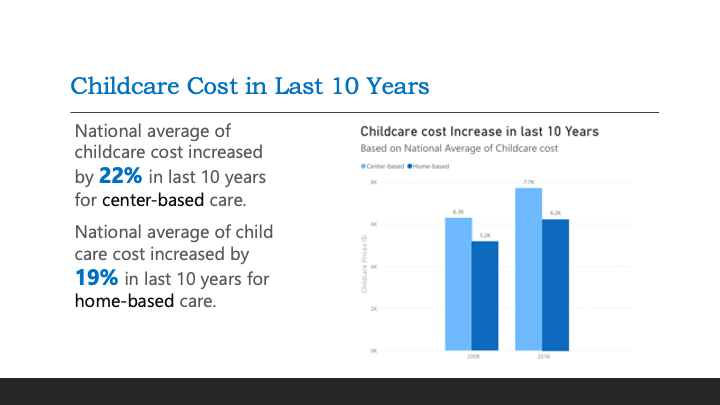
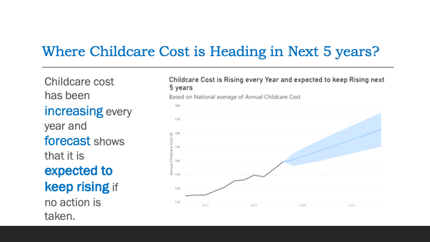
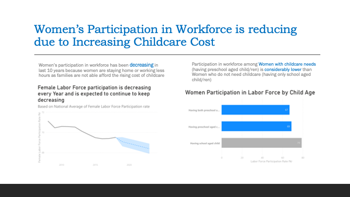
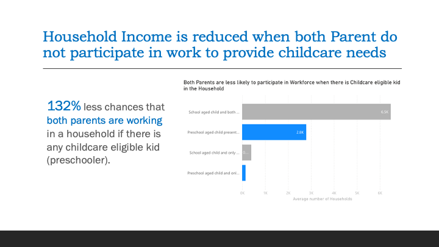
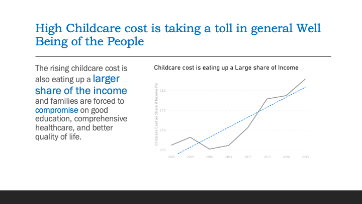

# Explanatory Analysis and Storytelling about Rising Childcare Prices

The childcare prices have been rising, which can have cascading impact on both people and the economy. The increased childcare cost causes financial burden on families and reduces their capability to spend on essential areas like healthcare, nutrition, and education. High childcare cost hinders individuals, particularly women from participating in the workforce, which causes reduction in household income and quality of life. Reduction in workforce and household income also has a detrimental effect on the economy as this results in reduced consumer spending, more dependence, and utilization of social welfare programs. The government must intervene to address this issue by bringing policies and reforms such as providing subsidiaries, higher tax credits for child and dependent care, and expansion of publicly funded childcare programs, essentially making it more affordable for all families and individuals.

### Datasets

The dataset is taken from The National Database of Childcare Prices (NDCP) which federal source of childcare prices at the county level. The database offers childcare price data by childcare provider type, age of children, and county characteristics. Data are available from 2008 through 2022 (National Database of Childcare Prices, n.d.).

**Note: The datasets can be downloaded from mentiond data sources and not available in `datasets` directory due to size constraints.**

### Mediums

- Powerpoint presentation: [Here][1]
- Billboard (Mock): [Here][2]

[1]:./Medium_Formal_Presentation.pptx
[2]:./Medium_GeneralPublic_Billboard.pdf

### Visualizations Design

The story in the mediums is organized following the general storytelling guidelines; introduction to the problem, adding another perspective to the problem and a call to action for resolution of the problem.

_White Spaces_
White spaces were used strategically to make the charts more aesthetic and reduce clutter. There is sufficient white spaces left in the charts so that it doesn’t appear overwhelming to the audience. Gap is kept between the Title and the plot so that there is natural attention to the title before audience starts looking at the actual chart.

_Color_
Color was sparingly used to draw attention to the message that needs to be conveyed. Shades of Gray were used to mute unimportant information and push those to background. While Blue and Black were used for highlighting the main idea or drawing attention to particular area/information.

_Text_
Chart titles were colored black with larger font size to convey the main idea of each plot. Axis titles were hidden wherever unnecessary to keep less information and reduce clutter. Axis titles were colored light Gray to push it in background and have audience focus on Black and Blue texts. Chart borders were hidden to make the actual plot more prominent and reduce any distraction. Chart titles and texts are left aligned for aesthetic and match the natural (zig-zag) order of English reading habits.

_Plots_
Horizontal bar plots were preferred because it is easy for audience to navigate from top to bottom and left to right while reading. Line plots were used to display continuous data that changes over time. A forecast line with 95% confidence interval was added in blue color to draw attention to the trend that can be expected in future years, while rest of the line plot is kept grey to show the data in the past years but with less focus. A darker shade of gray was used to make the plot stand out from the lighter gray colored axis and labels. 

### Major Visualizations

### Ethical Considerations

The dataset used in this study is publicly available data from US Department of Labor and does not contain any confidential information (National Data base of Childcare Prices, n.d.). Hence there is no concern of data privacy using this dataset. 
There was some transformation or imputation done to the dataset that may have altered the childcare prices and outcomes. Assumption was made that the lower participation rate in workforce among women having childcare eligible kids is a strong indication that high childcare cost may be causing such women to stay back home, but there may be also other factors which might need further analysis and were not considered in this study. We will need further demographic and socio-economic data from households to identify such factors which was considered out of scope for this study. National average of childcare price was used as a primary measure in this study, however presence of outliers in the data for some locations/states might skew the average and the outcomes of this study must be used with this diligence.

### References

  National Database of Childcare Prices (n.d.). U.S Department of Labor. 
  **https://www.dol.gov/agencies/wb/topics/featured-childcare**
